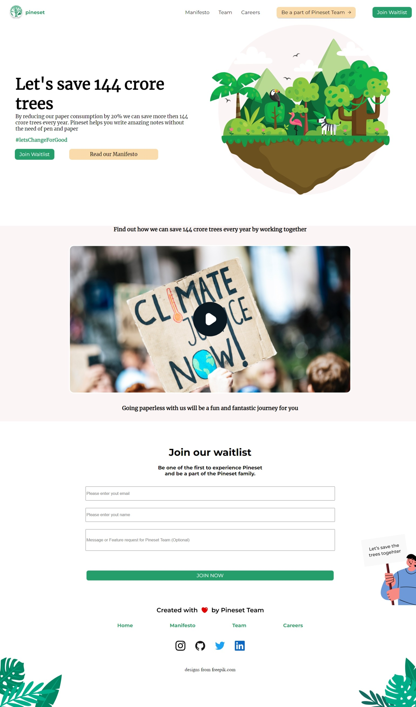
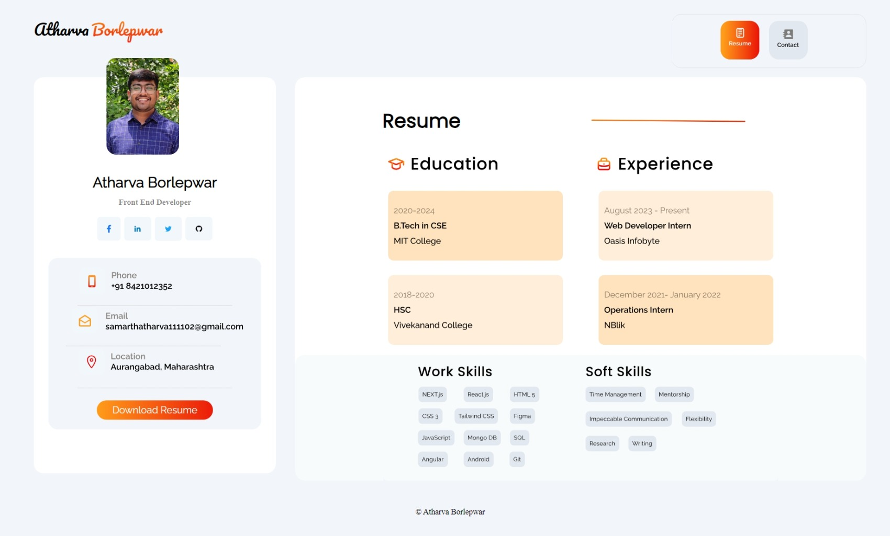
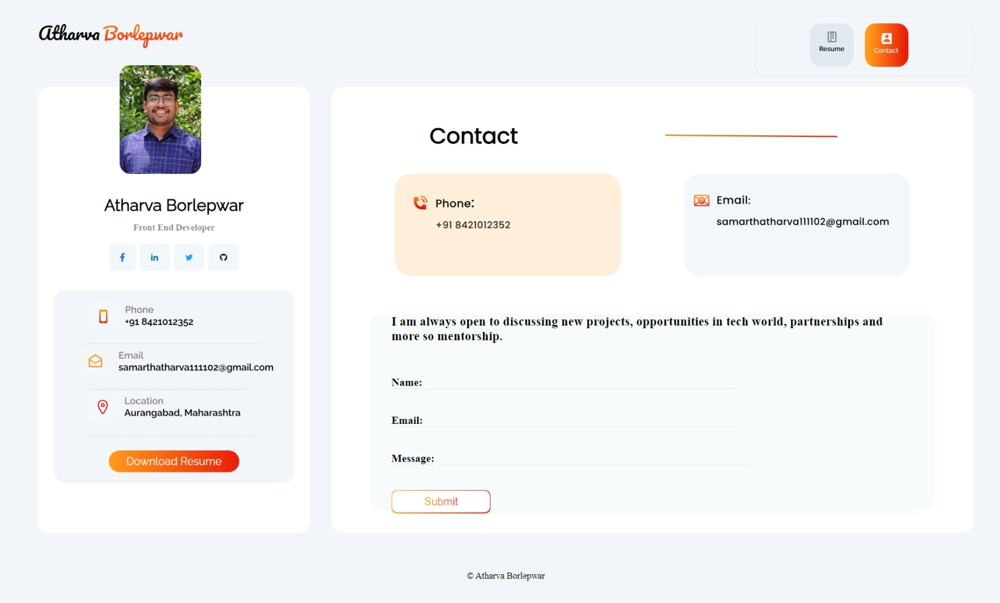
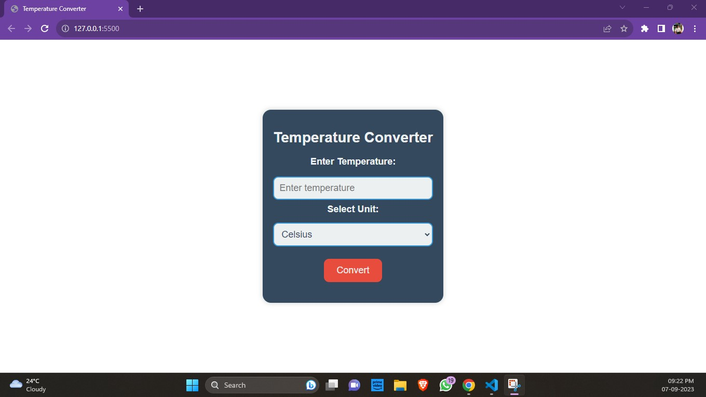

# Oasis Infobyte Tasks
- Task1:

In Task 1, I created a captivating landing page using HTML and CSS.
This landing page was designed for a fictional website called 'PineSet'

- Task2:

Task 2 involved the development of my personal portfolio using HTML and CSS. My portfolio serves as a showcase of my work and skills.

- Task3:

Task 3 featured a temperature converter created with HTML, CSS, and JavaScript. This interactive tool allows users to convert temperatures between different units.

